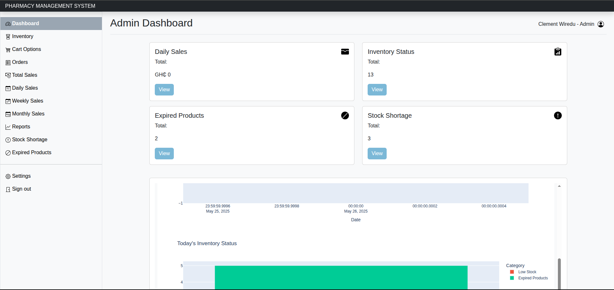

# Pharmacy Management System

A comprehensive solution designed to streamline pharmacy operations, enhance medication management, and improve customer service. This system is built with **Flask**, **MySQL**, and **Bootstrap** that integrates inventory control, prescription processing, customer records, generate invoices, analyze sales trends through Dash-powered charts into one user-friendly platform.


## Features

- ✅ User authentication (Admin, Pharmacist, Cashier roles)
- 🧾 Sales management with invoice generation (PDF)
- 🗂 Product inventory (add, edit, search, delete)
- 📈 Sales trend visualization using Dash
- 📅 Date-based sales filtering
- 🔐 Role-based access control

## Tech Stack

- **Backend**: Flask, MySQL
- **Frontend**: HTML, Bootstrap, Jinja2
- **Visualization**: Plotly Dash
- **PDF Generation**: ReportLab or WeasyPrint

## Getting Started

### 1. Clone the repository
```bash
git clone https://github.com/wireduclement/pharmacy-mgmt-system.git
```
    
### 2. Navigate to the project directory:
```bash
cd pharmacy-mgmt-system
```

### 3. Set up a virtual environment
```bash
python -m venv venv
source venv/bin/activate  # or venv\Scripts\activate on Windows
```

### 4. Install dependencies
```bash
pip install -r requirements.txt
```

### 5. Add your secret key in the .env file
```bash
SECRET_KEY=your_secret_key
```

### 6. Import Database Schema via phpMyAdmin
 - Open phpMyAdmin in your browser.
 - Create a new database (e.g. pharmacy_management).
 - Click on the database, go to the Import tab.
 - Choose the file schema.sql (included in the project).
 - Click Go to import the tables and structure.


### 7. Run the app
```python
python main.py
```

### Project Structure
```
├── database/              # Database interactions
├── schema/                # Schema for db
├── static/                # Static assets (css, svg, images)
├── templates/             # HTML templates (Jinja2)
├── .gitignore
├── main.py                # Flask application
├── pdf.py                 # PDF generator 
├── README.md      
└── requirements.txt 
```

### Screenshot (look into the static/images folder to see more)



### Future Improvements
 - SMS/email reminders for low stock
 - Barcode scanner integration
 - Expiry date tracking & notifications
